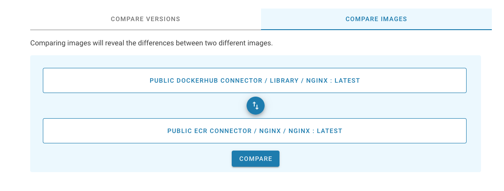
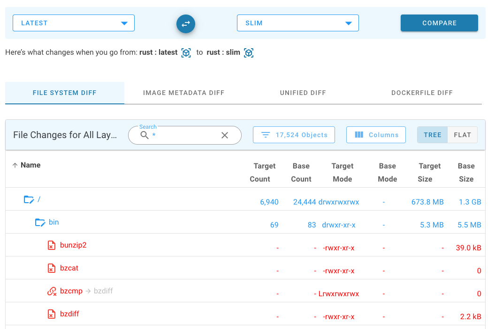
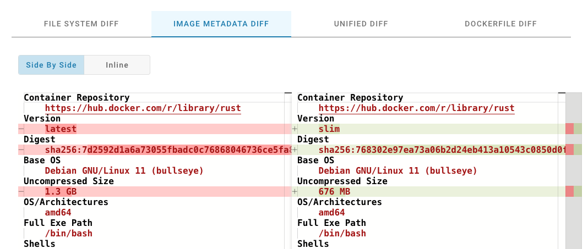

# Container Diff

**Comparing changes between your container versions**

While containers are (usually) immutable, software is not. Apps, libraries, dependencies, and metadata change all the time in container images, and keeping track of those changes is a daunting task.

**Container Diff** lets your easily see a git-like `diff` between one container version and another. It provides a Git-like comparison that developers are familiar with and that can be used in the following ways: 

* **Checking Updates:** Understanding what changed from one container version to another, useful when updating versions or debugging a breaking change.
* **Base image comparison:** Understanding differences in base images, say from `stable` to `latest` or `latest` to `slim` versions.
* **Slimmed Images:** If you've minified an image with DockerSlim or the Slim SaaS, Container Diff gives you an easy way of seeing what was removed and what was kept during that process.

## Getting Started with Container Diff

### Comparing Container Versions

The Container Diff feature can be accessed in several ways.

From any container profile, you'll find a list of available version tags.

On the right side of the column, you'll find a list of icons. Clicking the `Compare versions` icon will bring you to a screen where you can choose which versions to compare.

Choose the versions you want to diff and click `Compare`. The Slim platform will begin analyzing each image and bring you to the comparison screen. This can take a few minutes to complete. 

### Comparing Container Images

You can also diff completely different images. While it might not make sense to diff `python:latest` and `node:latest`, this feature is useful if your workflow doesn't allow you to easily tag new versions of your images, or if you are comparing various 3rd-party images of the same core technology.

To do so, find the image you want to compare and visit it's profile page. Click the "compare versions" icon on the image tag and then go to the "Compare Images" tab on the version selection screen.

From the UI, select a second image to compare to. You can choose from any public registry or even from your own private connections.

### Comparing Private Images

If you have [**Connectors**](./connectors.md) set up to import container images from your own public or private registries (i.e., Docker Hub, AWS ECR, GCR, etc), you can compare those versions or images the same way you would public images. Simply navigate to the container image profile screen and click the `Compare` icon on one of the versions you'd like to diff. 

## Understanding the Diff

Once the images are analyzed, you'll be brought to the comparison screen where you can access various comparisons of the two images. 

### File System Diff

In the first tab, you'll find a file-by-file comparison showing any **added, deleted,** or **modified** files between the container images. Filters in the sub-navigation bar allow you to trim the list to just specific file attributes (added, deleted, or modified; binary or text files). 

Clicking on any indvidual file will provide metadata about that file. If the file is a `TEXT` file, you can even see a GitHub-like diff of any modifications. 

  
_Modified text files can be examined directly to see changes._ 

### Image Metadata Diff

The Image Metadata tab provides a side-by-side comparison of key data generated by the Slim analysis tools. This information includes version info, size, layer information, and several other pieces of useful info generally available in the Slim Container Profiles. 

### Unified Diff

The Unified Diff view combines data from all the other views into a developer-friendly, GitHub-like summary of the changes between the containers. This includes the Dockerfile, Metadata, and File System changes. This view can be **downloaded** and even stored in a version control system like GitHub or GitLab to track changes over time. 

Clicking on files will open a side-by-side diff similar to File Contents tab described above. 

### Dockerfile Diff

Finally, the Dockerfile diff compares **generated** Dockerfile outputs of each image version. Like the generated Dockerfile in the Container Profiles, these are not meant to be used to create images, but rather can highlight differences in Instructions, Files, or Layer creation as detected by our build analysis tools.

::: tip
## Need more? 
Container Diff is particularly useful for teams managing change in their container pipelines. If you're interested in using Container Diff at scale with your team, contact us at **partners@slim.ai** to learn more about our Design Partner program. 
::: 