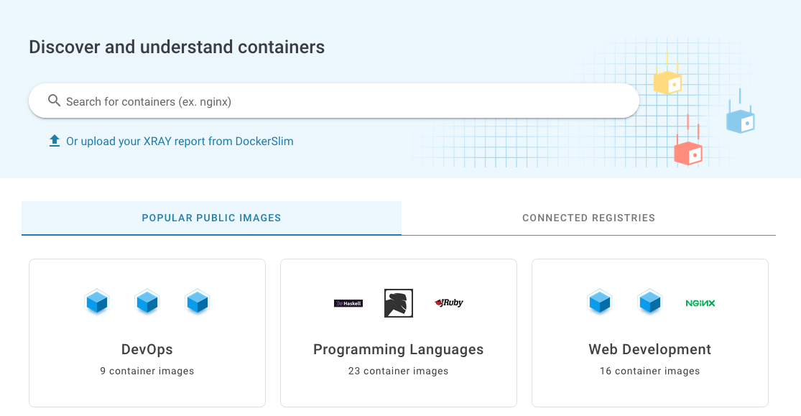
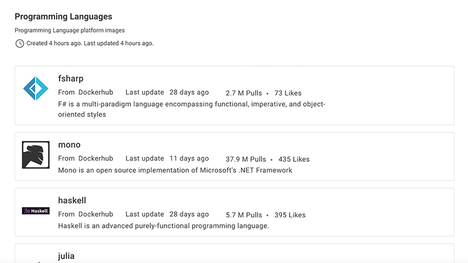
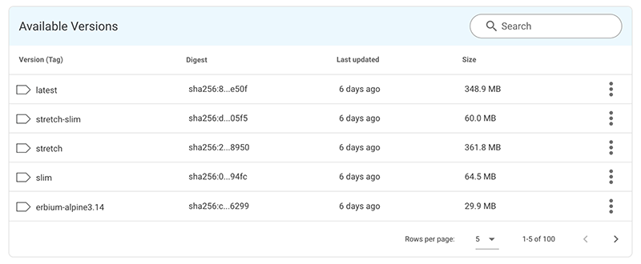
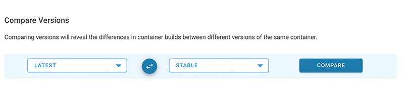

# Getting Started

Need to choose the right Docker container for a new project but don’t know where to start? Want to see how your container is built and see what lives inside it? Wondering _how_ you can effectively achieve [container best practices](https://www.slim.ai/blog/why-don%E2%80%99t-we-practice-container-best-practices.html)?

The Slim Developer Platform allows you to search containers from popular repositories and understand how they get created. It gives you a great starting point for future optimizations, and can be combined with [DockerSlim](https://github.com/docker-slim/docker-slim) to create production-ready containers with minimal fuss.

Here’s how to use our web portal.

## **1. Create an Account**

You can join by [clicking this link](https://portal.slim.dev/login?invitecode=invite.1ua3zgxhhokfmDbtOLJH8jD6ooR) or those on our Slim.AI homepage. We are in our early days, and may limit the number of new users allowed at certain points to ensure we're delivering a high-quality product.

Accounts are free and there is no charge to use the platform at this time. We're container enthusiasts, not salesfolk, so know that your privacy and security are founding principles of our business. We won't bug you with useless emails or sales pitches. We do appreciate getting your feedback on what we're building.

If you already have an account, you can simply visit [**portal.slim.dev/login**](https://portal.slim.dev/login) to log in. On successful login, you will see the container search interface.

Click on your username to see account information or switch to the Dark Mode UI if that’s your preference.

_Dark Mode UI is a Team Slim favorite._

You’ll also notice a **Feedback** tab on the left — if you encounter errors, have feature requests, or want to share some love/hate on the product, please do! Your feedback helps guide our roadmap and is critical to our success.

## **2. Find a container**

From the search interface, you can find containers from multiple container registries — including Docker Hub, AWS Elastic Container Registry Public Gallery, and RedHat Quay (with more public registries coming soon).

You can look for images to start your project in two ways:

* **Search**
  Simply search for a container using our search interface. You can search by container name, tag, or pull command. We'll search public registries as well as any Connected Registries you've authenticated already. Search results are filterable by source.
* **Browse**
  We’ve curated a list of images in major subject matter areas to help you find the best images to start your project or find the containers you need to develop your app. Have suggestions for categories? Let us know.

Once on the list page, matching images will appear in a list along with basic metadata. Clicking on an image listing will take you to the image's profile page.  Simply click on the image card to go to the profile page.

If you are a DockerSlim user, you can also upload a local **DockerSlim XRay** report to get a container profile. This is useful if your containers are primarily available on your local machine or if you can't connect a personal or work registry (see [Connectors](./connectors.md)).

## **3. Analyze a Container**

Once you’ve found an image that looks interesting, you can select a version from the drop-down to inspect it further. The profile page gives you a view of artifacts common to the container repository.

Available versions are listed in the profile page. Clicking on the version row will scan the image and bring you to the Version Detail page for that image version.

In the menu on the right-hand side of each you, you'll find a menu with links to:

**View Version -** This option scans the image and brings you to the [Version Detail ](./container-profile.md)page.

**Add to Favorites -** This will add the image version to your [**Favorites**](https://www.slim.ai/docs/collections.html) collection.

**Compare Versions -** This option allows you to choose two versions of the same image and compare them using our [**Diff**](./container-diff.md) feature. If available, you may find the Alpine Linux version or any maintainer supported “slim” versions that have already been optimized by the maintainers. These images may be more appropriate to your use case, but keep in mind that starting with a bare-bones image may cause headaches later in development.

Now that you have the basics of container analysis down, you can take a deeper look at our core feature set, such as [**Profiles**](./container-profile.md), [**Connectors**](./connectors.md), [**Container Diff**](./container-diff.md), and [**Favorites**](./favorites.md)**.**

\---

Looking for more tips and tricks to using Slim Developer Platform and DockerSilm? [Join our community](https://community.slim.ai/) to connect with other Docker practitioners and get announcements of new features, instructional content on optimizing containers, and free giveaways.